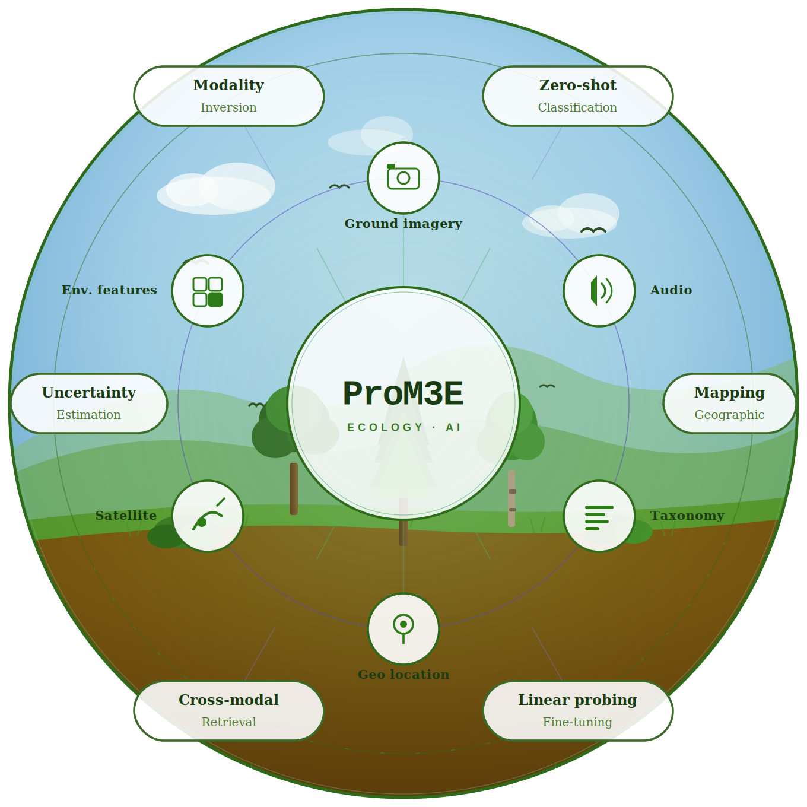
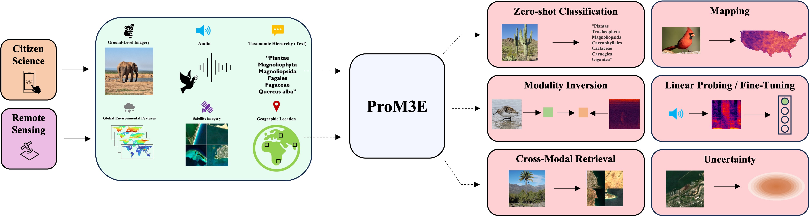
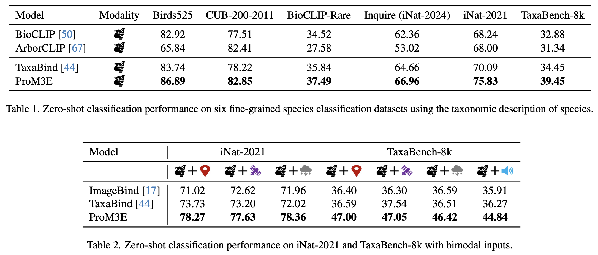

# ProM3E: Probabilistic Multi-Modal Masked Embedding Model

<div align="center">


[](https://arxiv.org/pdf/2511.02946)
[](https://vishu26.github.io/prom3e/index.html)
[](https://huggingface.co/MVRL/ProM3E)
[]()</center>

[Srikumar Sastry*](https://vishu26.github.io/),
[Subash Khanal](https://subash-khanal.github.io/),
[Aayush Dhakal](https://scholar.google.com/citations?user=KawjT_8AAAAJ&hl=en),
[Jiayu Lin](),
[Dan Cher](),
[Phoenix Jarosz](),
[Nathan Jacobs](https://jacobsn.github.io/)
(*Corresponding Author)

#### CVPR 2026
</div>

This repository is the official implementation of [ProM3E](https://arxiv.org/pdf/2511.02946).
ProM3E is a probabilistic multimodal model that learns to predict missing modalities in the embedding space given the observed ones. This improves representations of existing encoders and enables robust multimodal learning.




## 🎯 Zero-Shot Image Classification

Our framework outperforms the state-of-the-art in both unimodal (BioCLIP, ArborCLIP, TaxaBind) and multimodal setting (ImageBind, TaxaBind).

## 🔥 Large Mulitmodal Ecological Datasets

* We release [MultiNat](), a truly multimodal dataset containing six paired modalities for evaluating large ecological models.

📑 Citation

```bibtex
@inproceedings{sastry2026prom3e,
    title={ProM3E: Probabilistic Multi-Modal Masked Embedding Model},
    author={Sastry, Srikumar and Khanal, Subash and Dhakal, Aayush and Ahmad, Adeel and Jacobs, Nathan},
    booktitle={Conference on Computer Vision and Pattern Recognition},
    year={2026},
    organization={IEEE/CVF}
}
```


## 🔍 Additional Links
Check out our lab website for other interesting works on geospatial understanding and mapping:
* Multi-Modal Vision Research Lab (MVRL) - [Link](https://mvrl.cse.wustl.edu/)
* Related Works from MVRL - [Link](https://mvrl.cse.wustl.edu/publications/)
